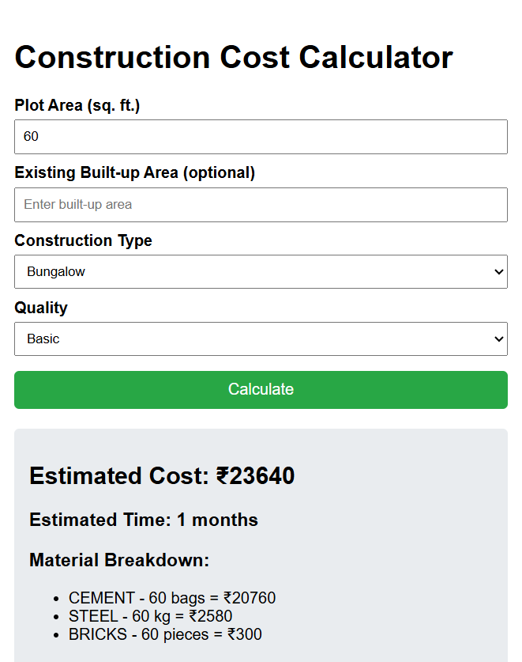

# 🏗 Construction Cost Calculator

## 📌 Project Overview
This is a **web-based Construction Cost Calculator** developed as part of the internship assignment for **Vidhi Architects**.  
The tool helps users estimate **construction and interior costs** based on inputs like plot area, built-up area, construction type, and material quality.

It provides:
- ✅ Estimated construction cost  
- ✅ Estimated project completion time  
- ✅ Material requirements (cement, steel, bricks, etc.)  
- ✅ User-friendly, responsive UI

---

## ⚙️ Tech Stack
- HTML5  
- CSS3  
- JavaScript (Vanilla JS)

---

## 🧮 Calculation Logic
- **Material Cost** = Quantity × Rate (depends on quality)  
- **Total Cost** = Sum of all material costs  
- **Estimated Time** = 1 month per 1000 sq. ft.  
- **Labor Requirement** = 1 labor per 500 sq. ft.  

---

## 🖥️ Features
- Input form for plot area, built-up area, construction type, and material quality  
- Cost estimation with material breakdown  
- Estimated completion time based on area  
- Responsive and clean UI  

---

## 📂 File Structure
construction-cost-calculator/
│── index.html # UI structure
│── style.css # Styling
│── script.js # Calculation logic
│── README.md # This file

# 🚀 How to Run
1. Open `index.html` in your browser.  
2. Enter the inputs → Click **Calculate**.  
3. View results with cost, time, and material breakdown.  
